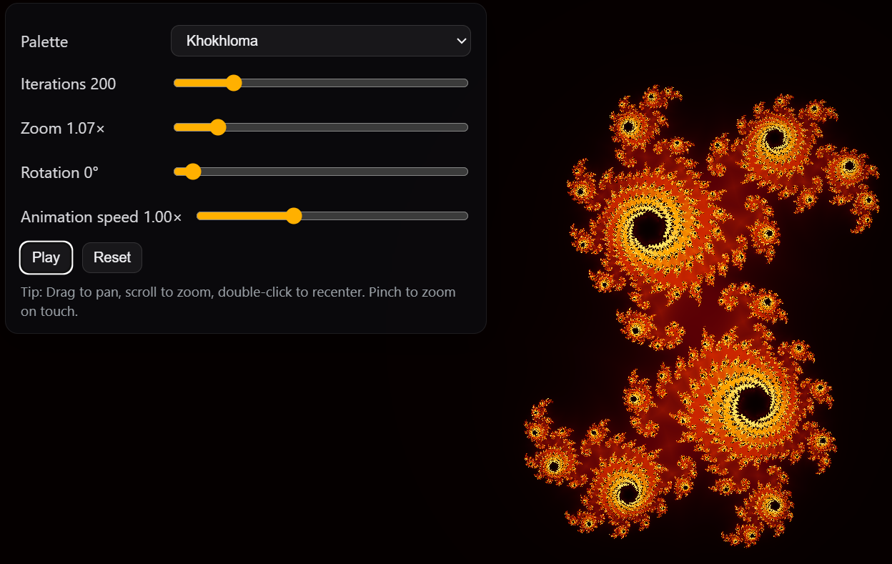

# Art Morph — GPU Fractal & Ornaments

Interactive WebGL (WebGL1) demo that renders multiple fractal types (GPU and 2D overlay) with palettes inspired by Khokhloma and Gzhel, plus a rainbow mode. Includes mouse/touch interactions: zoom, pan, rotation, iterations, speed.



This repository contains a small webpack setup for local development, production builds, and easy publishing to GitHub Pages.

## Demo (after you publish)
- GitHub Pages URL (project site): `https://<your-username>.github.io/<repo-name>/`
- Or for a user/org site repo named `<your-username>.github.io`: `https://<your-username>.github.io/`

## Prerequisites
- Node.js 18+ (recommended) and npm 9+
- Git

Check versions:

```bash
node -v
npm -v
```

## Install

```bash
npm install
```

## Run locally (development)

Starts webpack-dev-server with live reload. It serves the repo root as static content and builds the JS bundle in-memory.

```bash
npm start
```

The dev server should open your default browser automatically. If it doesn’t, open the printed local URL (typically `http://localhost:8080`).

## Build (production)

Creates an optimized build in `dist/` with all required static assets copied.

```bash
npm run build
```

### Preview the production build locally
Because of browser security, open `dist/index.html` via a local web server (not the `file://` URL).

One‑liner options:
- Using Node (no install):
  ```bash
  npx serve dist
  ```
- Using Python 3:
  ```bash
  cd dist
  python -m http.server 8080
  # then visit http://localhost:8080
  ```

## Publish to GitHub Pages

This project is configured for GitHub Pages deployment out of the box. All asset links are relative, so it works both as a project site (`/<repo-name>/`) and a user/org site (`/`).

There are two common ways to publish:

### Option A — Use the npm script (gh-pages branch)

1. Ensure your repo has a remote set up and all local changes are committed:
   ```bash
   git remote -v
   git add -A && git commit -m "Prepare Pages deploy"
   git push origin main
   ```
2. Deploy to the `gh-pages` branch:
   ```bash
   npm run deploy
   ```
   This runs `npm run build` and publishes the `dist/` folder to the `gh-pages` branch using the `gh-pages` package.
3. In your GitHub repository settings:
   - Go to Settings → Pages
   - Source: select `Deploy from a branch`
   - Branch: `gh-pages` and folder `/ (root)`
   - Save
4. Wait a minute for the site to become available at:
   - Project site: `https://<your-username>.github.io/<repo-name>/`
   - User site (if your repo is named `<your-username>.github.io`): `https://<your-username>.github.io/`

Notes:
- The `dist/` directory is ignored by Git for normal commits (`.gitignore`), but the deploy script publishes it directly to the `gh-pages` branch. No manual commits to `dist/` are needed.
- A `404.html` is included and copied into `dist/` to support client‑side routing or broken links on Pages (even though this app doesn’t use a router).

### Option B — GitHub Actions (automatic on push)

If you prefer automatic deployments on every push to `main`, create a workflow file like this:

```yaml
name: Deploy to GitHub Pages

on:
  push:
    branches: [ main ]

permissions:
  contents: read
  pages: write
  id-token: write

jobs:
  build:
    runs-on: ubuntu-latest
    steps:
      - uses: actions/checkout@v4
      - uses: actions/setup-node@v4
        with:
          node-version: 18
      - run: npm ci
      - run: npm run build
      - uses: actions/upload-pages-artifact@v3
        with:
          path: dist
  deploy:
    needs: build
    runs-on: ubuntu-latest
    environment:
      name: github-pages
      url: ${{ steps.deployment.outputs.page_url }}
    steps:
      - id: deployment
        uses: actions/deploy-pages@v4
```

Then in Settings → Pages, set Source to “GitHub Actions”.

## Project layout

- `index.html` — page template (keeps script and asset links relative for Pages)
- `js/app.js` — main WebGL application and overlay 2D renderer for line/tree fractals
- `css/style.css` — styles
- `img/`, `icon.svg`, `icon.png`, `favicon.ico`, `site.webmanifest`, `404.html`, `robots.txt` — static assets; copied to `dist/` during build
- `webpack.*.js` — build configuration

## Controls (in the UI)

- Fractal: choose fractal type
  - Linear: Koch curve, Peano (3×3)
  - Planar (shader): Sierpinski triangle, Sierpinski carpet
  - Volumetric (sliced in 2D): Menger sponge, Sierpinski pyramid
  - Tree‑like: Pythagoras tree, generic L‑system plant
- Palette: switch color schemes
- Iterations: fractal depth/iteration count (meaning depends on type)
- Zoom: scale in/out
- Rotation: rotate the view/plane
- Speed: animation speed (affects Julia morphing and 3D slice animation); Pause/Reset buttons
- Recenter: button to reset the view center to the default for the current fractal
- Interactions: drag to pan, scroll to zoom; double‑click the canvas to toggle the Settings panel; on touch, pinch to zoom

## Troubleshooting

- Blank screen or error about WebGL: your browser/device may not support WebGL 1. Try a different browser or update your drivers.
- On GitHub Pages under a subpath, assets 404: make sure you’re visiting the full project URL (`https://<user>.github.io/<repo>/`), not just `https://<user>.github.io/`. All links are relative, so they should work as long as the base URL includes the repo path.
- Double script inclusion (advanced): If you add additional HtmlWebpackPlugin instances or change template settings, ensure the bundle isn’t injected twice. In this repo, the production build uses your `index.html` template and references `js/app.js` directly.
- Overlay not visible for line/tree fractals: ensure the `#overlay2d` canvas is present in `index.html` and not hidden by CSS; it’s drawn above the WebGL canvas and has `pointer-events: none`.

## License

See `LICENSE.txt`.
